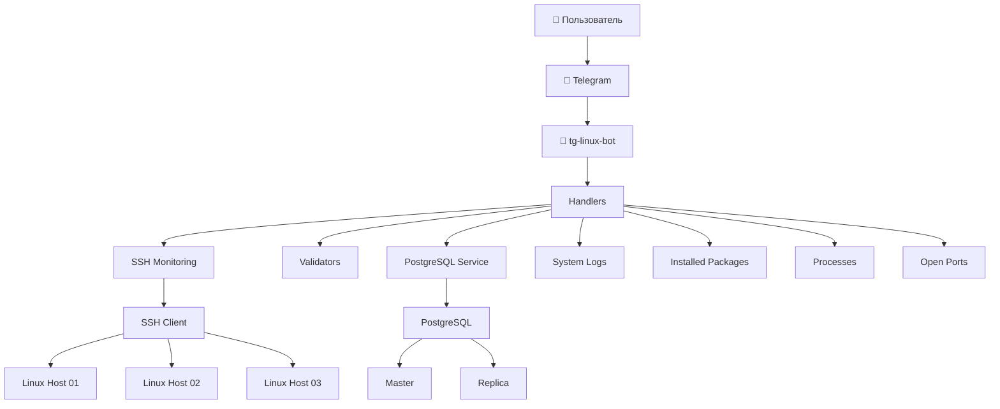

<div align="center">

# 🤖 tg-linux-bot

### Telegram-бот для администрирования и мониторинга Linux-серверов через SSH

Мониторинг серверов • PostgreSQL • Docker • Ansible • Python 3.13


Современный Telegram-бот для удалённого администрирования Linux-серверов. Позволяет выполнять мониторинг системы по SSH, работать с PostgreSQL, искать email и телефонные номера в тексте, проверять сложность паролей и автоматизировать развёртывание с помощью Docker и Ansible.

[🚀 Быстрый старт](#-быстрый-старт)
•
[📖 Документация](docs/)
•
[🐳 Docker](#-запуск-в-docker)
•
[⚙️ Ansible](#️-развёртывание-через-ansible)

</div>

---

# 📖 О проекте

**tg-linux-bot** — учебный, но максимально приближённый к реальным условиям эксплуатации проект, демонстрирующий разработку Telegram-бота для администрирования Linux-серверов.

Основные возможности проекта:

- удалённое подключение к Linux-хостам по SSH;
- получение информации о состоянии системы;
- взаимодействие с PostgreSQL;
- хранение найденных данных;
- автоматизация развёртывания через Docker Compose и Ansible;
- модульная архитектура с разделением логики по сервисам и обработчикам;
- покрытие тестами (`pytest`).

Проект ориентирован на изучение:

- Python 3.13;
- разработки Telegram-ботов;
- администрирования Linux;
- Docker;
- Ansible;
- PostgreSQL;
- практик DevOps.

---

# ✨ Возможности

## 🖥️ Мониторинг Linux

Получение информации о сервере через SSH.

- 📊 загрузка CPU
- 💾 использование оперативной памяти
- 💿 использование дисков
- ⏱ время работы системы
- 👥 активные пользователи
- ⚙️ список процессов
- 🔌 открытые порты
- 📦 установленные пакеты
- 📝 системные журналы
- 🚨 критические события

---

## 🗄 Работа с PostgreSQL

Бот умеет взаимодействовать с базой данных.

- сохранение email
- сохранение телефонов
- чтение данных
- просмотр логов репликации

---

## 🔍 Работа с текстом

Встроенные валидаторы позволяют:

- искать email-адреса;
- искать телефонные номера;
- проверять сложность паролей.

---

## 🐳 DevOps

Проект поддерживает несколько вариантов развёртывания.

- локальный запуск
- Docker Compose
- Ansible Playbook
- тестовая инфраструктура
- SSH-доступ к контейнерам

---

## 🧪 Тестирование

В проект входят:

- unit-тесты;
- integration-тесты;
- поддержка `pytest`;
- поддержка `pytest-asyncio`.

---

# 🏗 Архитектура

Проект построен по модульному принципу.

Каждая подсистема отвечает только за свою область ответственности.

| Модуль | Назначение |
|---------|------------|
| `handlers` | Обработка Telegram-команд |
| `services` | Работа с SSH и PostgreSQL |
| `validators` | Проверка email, телефонов и паролей |
| `keyboards` | Telegram-клавиатуры |
| `middlewares` | Middleware бота |
| `utils` | Вспомогательные функции |
| `tests` | Unit и Integration тесты |

Такое разделение позволяет легко добавлять новые команды, сервисы и источники данных без изменения существующей логики.

---

# 📐 Архитектурная схема



---

#📁 Структура проекта
Проект организован по модульному принципу и состоит из следующих основных частей:

```text
tg-linux-bot/
├── app/                          # Исходный код бота
│   ├── handlers/                 # Обработчики команд Telegram
│   │   ├── find.py               # Поиск email и телефонов
│   │   ├── monitoring.py         # Команды мониторинга через SSH
│   │   ├── password.py           # Проверка пароля
│   │   └── postgres.py           # Работа с PostgreSQL
│   ├── services/                 # Сервисный слой
│   │   ├── ssh_client.py         # SSH-клиент
│   │   ├── postgres_client.py    # Клиент PostgreSQL
│   │   ├── repl_logs.py          # Логи репликации
│   │   └── system_metrics.py     # Сбор метрик системы
│   ├── validators/               # Валидаторы (email, телефон, пароль)
│   ├── keyboards/                # Клавиатуры для Telegram
│   ├── middlewares/              # Middleware (обработка сессий и т.п.)
│   ├── utils/                    # Вспомогательные функции
│   ├── config.py                 # Загрузка переменных окружения
│   └── main.py                   # Точка входа
│
├── infrastructure/               # Инфраструктура развёртывания
│   ├── ansible/                  # Ansible playbook и конфигурация
│   │   ├── playbook_tg_bot.yml   # Основной плейбук
│   │   ├── inventory             # Хосты и переменные
│   │   └── ansible.cfg           # Конфигурация Ansible
│   └── docker/                   # Docker Compose для локальной инфраструктуры
│       └── docker-compose.yml    # Поднимает три контейнера-хоста
│
├── tests/                        # Тесты
│   ├── unit/                     # Unit-тесты
│   └── integration/              # Интеграционные тесты
│
├── docs/                         # Документация
├── scripts/                      # Вспомогательные скрипты
├── logs/                         # Логи (при локальном запуске)
│
├── .env.example                  # Шаблон переменных окружения
├── .gitignore
├── pyproject.toml                # Настройки линтеров (black, isort, pylint, mypy)
├── requirements.txt              # Зависимости Python
├── README.md
└── LICENSE
```

---

# 🌿 Ветки репозитория

Репозиторий содержит три основные ветки, каждая из которых предназначена для своей цели:

| Ветка | Содержимое | Назначение |
|-------|------------|------------|
| **`main`** | Только код бота (`app/`, `requirements.txt`, `.env.example`, `README.md`, `pyproject.toml` и т.д.) | Базовый код для разработки и локального запуска |
| **`docker`** | Код бота + `Dockerfile`, `docker-compose.yml`, `.env.example` | Запуск бота в изолированном Docker-контейнере |
| **`ansible`** | Код бота + папка `infrastructure/ansible/` с плейбуком, инвентаризацией и конфигом | Автоматическое развёртывание на трёх хостах (Master DB, Replica DB, Bot Host) |


## 🚀 Быстрый старт

### 🔹 Локальный запуск (ветка `main`)

1. Клонировать репозиторий и переключиться на `main`:
   ```bash
   git clone https://github.com/zackshal/tg-linux-bot-deploy.git
   cd tg-linux-bot-deploy
   git checkout main
   ```

2. Создать виртуальное окружение и активировать:
   ```bash
   python3 -m venv venv
   source venv/bin/activate
   ```

3. Установить зависимости:
   ```bash
   pip install -r requirements.txt
   ```

4. Создать файл `.env` из шаблона и отредактировать его:
   ```bash
   cp .env.example .env
   nano .env   # или любой другой редактор
   ```
   Обязательно укажите:
   - `TOKEN` — токен Telegram-бота (получить у [@BotFather](https://t.me/BotFather)).
   - `RM_HOST`, `RM_PORT`, `RM_USER`, `RM_PASSWORD` — данные для SSH-подключения (если используется мониторинг).
   - `DB_HOST`, `DB_PORT`, `DB_USER`, `DB_PASSWORD`, `DB_DATABASE` — данные PostgreSQL.

5. Запустить бота:
   ```bash
   python -m app.main
   ```

---

### 🐳 Запуск в Docker (ветка `docker`)

1. Переключиться на ветку `docker`:
   ```bash
   git checkout docker
   ```

2. Создать `.env` (аналогично шагу 4 выше).

3. Собрать и запустить контейнер:
   ```bash
   docker compose up -d
   ```
4. Проверьте логи:
   ```bash
   docker compose logs -f bot
   ```
5. Остановка:
   ```bash
   docker compose down
   ```
Бот будет доступен внутри контейнера и будет использовать переменные из `.env`.

---

### ⚙️ Развёртывание всей инфраструктуры через Ansible (ветка `ansible`)

Этот способ поднимает три виртуальные машины (в контейнерах) с PostgreSQL Master, Replica и самим ботом. Все три сервиса настраиваются автоматически.

1. Переключиться на ветку `ansible`:
   ```bash
   git checkout ansible
   ```

2. Поднять три контейнера-хоста (для локального тестирования):
   ```bash
   docker compose -f infrastructure/docker/docker-compose.yml up -d
   ```
   Будут созданы контейнеры:
   - `host01` — мастер БД (SSH: 2224, PostgreSQL: 5434)
   - `host02` — реплика БД (SSH: 2223, PostgreSQL: 5435)
   - `host03` — хост для бота (SSH: 2225)

3. Скопировать публичный SSH-ключ в каждый контейнер (если ключа нет – создать `ssh-keygen -t ed25519`):
   ```bash
   # Для host01
   docker exec -it host01 bash -c "mkdir -p /config/.ssh && chmod 700 /config/.ssh"
   docker cp ~/.ssh/id_ed25519.pub host01:/config/.ssh/authorized_keys
   docker exec -it host01 bash -c "chown -R ansible:ansible /config/.ssh && chmod 600 /config/.ssh/authorized_keys"

   # Повторить для host02 и host03 (заменив host01 на host02 / host03)
   ```

4. Установить Python в каждом контейнере:
   ```bash
   docker exec host01 apk add python3
   docker exec host02 apk add python3
   docker exec host03 apk add python3
   ```

5. Перейти в папку с Ansible и запустить плейбук, передав токен:
   ```bash
   cd infrastructure/ansible
   ansible-playbook -i inventory playbook_tg_bot.yml --extra-vars "telegram_token=ВАШ_ТОКЕН"
   ```

6. После успешного выполнения бот будет запущен на `host03`. Проверить логи:
   ```bash
   docker exec host03 tail -f /opt/bot/nohup.out
   ```

---

## ⚙️ Переменные окружения `.env`

Бот использует переменные окружения для конфигурации. Ниже приведена таблица всех поддерживаемых переменных.

| Переменная | Описание | Обязательность | Пример |
|------------|----------|----------------|--------|
| `TOKEN` | Токен Telegram-бота (получить у @BotFather) | ✅ Да | `123456:ABC-DEF` |
| `RM_HOST` | IP-адрес или домен Linux-хоста для мониторинга | ✅ Да | `192.168.1.10` |
| `RM_PORT` | Порт SSH на удалённом хосте | ❌ Нет (по умолчанию `22`) | `22` |
| `RM_USER` | Имя пользователя для SSH | ✅ Да | `admin` |
| `RM_PASSWORD` | Пароль для SSH | ✅ Да | `my_secure_password` |
| `DB_USER` | Пользователь PostgreSQL | ✅ Да | `dbuser` |
| `DB_PASSWORD` | Пароль пользователя PostgreSQL | ✅ Да | `dbpass` |
| `DB_HOST` | Хост PostgreSQL | ✅ Да | `localhost` или `master_db` |
| `DB_PORT` | Порт PostgreSQL | ❌ Нет (по умолчанию `5432`) | `5432` |
| `DB_DATABASE` | Имя базы данных | ✅ Да | `mydb` |
| `DB_REPL_USER` | Пользователь для репликации | ❌ Нет | `repluser` |
| `DB_REPL_PASSWORD` | Пароль пользователя репликации | ❌ Нет | `replpass` |
| `DB_REPL_HOST` | Хост реплики | ❌ Нет | `replica_db` |
| `DB_REPL_PORT` | Порт реплики | ❌ Нет | `5432` |
| `PG_HOST` | Хост для клиента PostgreSQL (может совпадать с `DB_HOST`) | ❌ Нет | `localhost` |
| `PG_PORT` | Порт для клиента PostgreSQL | ❌ Нет | `5432` |
| `PG_SLAVE_HOST` | Хост реплики для клиента | ❌ Нет | `127.0.0.1` |
| `PG_SLAVE_PORT` | Порт реплики для клиента | ❌ Нет | `5433` |
| `PG_DB` | Имя БД для клиента | ❌ Нет | `db_customers` |
| `PG_USER` | Пользователь для клиента | ❌ Нет | `postgres` |
| `PG_PASSWORD` | Пароль для клиента | ❌ Нет | `a1b2c3d4` |

**Важно:** никогда не заливайте `.env` в репозиторий – он добавлен в `.gitignore`.

---

## 📋 Команды бота

Все команды доступны через Telegram-бота.

### 🖥️ Мониторинг Linux (через SSH)

| Команда | Описание |
|---------|----------|
| `/get_release` | Информация о релизе ОС |
| `/get_uname` | Архитектура, имя хоста, версия ядра |
| `/get_uptime` | Время работы системы |
| `/get_df` | Использование дисковых разделов |
| `/get_free` | Использование оперативной памяти |
| `/get_mpstat` | Загрузка CPU (средняя) |
| `/get_w` | Активные пользователи и нагрузка |
| `/get_auths` | Последние 10 успешных входов |
| `/get_critical` | Последние 5 критических событий (журнал) |
| `/get_ps` | Список запущенных процессов |
| `/get_ss` | Список открытых сетевых портов |
| `/get_services` | Список запущенных сервисов (systemd) |
| `/get_apt_list` | Установленные пакеты (с возможностью поиска) |

### 🔍 Поиск и валидация

| Команда | Описание |
|---------|----------|
| `/find_email` | Найти email-адреса в переданном тексте |
| `/find_phone_number` | Найти номера телефонов в переданном тексте |
| `/verify_password` | Проверить сложность пароля (длина ≥ 8, заглавные, строчные, цифры, спецсимволы) |

### 🗄️ PostgreSQL

| Команда | Описание |
|---------|----------|
| `/get_repl_logs` | Показать последние строки лога репликации PostgreSQL |
| `/get_emails` | Показать все сохранённые email-адреса из БД |
| `/get_phone_numbers` | Показать все сохранённые номера телефонов из БД |
| `/add_email` | Добавить email в БД (извлечение из текста) |
| `/add_phone` | Добавить телефон в БД (извлечение из текста) |

---

## 🛠️ Troubleshooting (устранение проблем)

| Проблема | Решение |
|----------|---------|
| **Бот не запускается, ошибка `ModuleNotFoundError`** | Убедитесь, что виртуальное окружение активировано и все зависимости установлены: `pip install -r requirements.txt` |
| **Ошибка подключения к Telegram API (таймаут)** | Проверьте доступ к интернету. Если он заблокирован, используйте VPN или настройте прокси (в коде есть поддержка SOCKS5). |
| **SSH-подключение не работает** | Проверьте, что контейнеры с хостами запущены (`docker ps`), порты проброшены и SSH-ключ скопирован корректно. |
| **Ansible не видит хосты** | Проверьте файл `inventory` – порты должны совпадать с проброшенными (2224, 2223, 2225). Убедитесь, что контейнеры запущены. |
| **Ошибка репликации PostgreSQL** | Проверьте, что мастер (`host01`) и реплика (`host02`) запущены, и в плейбуке указаны правильные имена хостов (`master_db`, `replica_db`). |
| **Бот отвечает, но команды мониторинга не работают** | Проверьте правильность `RM_HOST`, `RM_USER`, `RM_PASSWORD` в `.env`. Попробуйте подключиться вручную: `ssh -p 2224 ansible@localhost` (для контейнеров). |
| **Команды PostgreSQL не работают** | Убедитесь, что база данных инициализирована, пользователь создан. Проверьте переменные `DB_*` в `.env`. |
